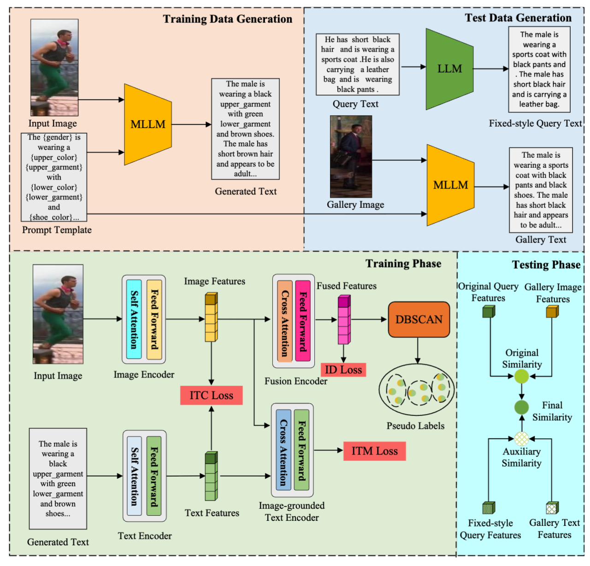

# TSN





Install dependencies

```
pip install -r requirements.txt
```


### Prepare pretrained model

Download pretrained baseline from [model_base](https://storage.googleapis.com/sfr-vision-language-research/BLIP/models/model_base.pth ) from [BLIP](https://github.com/salesforce/BLIP) and put **model_base.pth** at **./checkpoint**


### Prepare datasets

Download datasets: [CUHK-PEDES](https://github.com/ShuangLI59/Person-Search-with-Natural-Language-Description)   [ICFG-PEDES](https://github.com/ShuangLI59/Person-Search-with-Natural-Language-Description)  [RSTPReid](https://github.com/NjtechCVLab/RSTPReid-Dataset) and put at **./datasets**

The files shall be organized as:

```
|---configs
|---data
|---models
|---datasets
|	---CUHK-PEDES
|	---ICFG-PEDES
|	---RSTPReid
|---checkpoint
|	---model_base.pth
```

### Generate train data

```
python gen_train_data.py
```

### Generate test data

```
python gen_test_data.py
```
Download generated [Data](https://huggingface.co/datasets/jieLong09/TSN_data/tree/main) 
```
|---pre_gen_data
|	---cuhk_qwen_gen_captions.json
|	---cuhk_test_qwen_gen_captions.json
|	---icfg_qwen_gen_captions.json
|	---icfg_test_qwen_gen_captions.json
|	---rstp_qwen_gen_captions.json
|	---rstp_test_qwen_gen_captions.json
```
### Train

```
bash train.bash
```


If you have problem in downloading pretrained BERT models here:

```
tokenizer = BertTokenizer.from_pretrained('bert-base-uncased')
```

you may manually download it from [hugging face](https://huggingface.co/docs/transformers/model_doc/bert#bert) and use this instead:

```
tokenizer = BertTokenizer.from_pretrained(bert_localpath)
```


### Evaluation

```
python test.py
```
[Model & log for CUHK-PEDES](https://huggingface.co/jieLong09/TSN_model/tree/main) Extraction code segp


